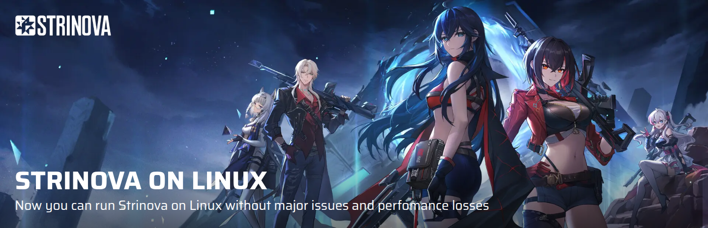

# Strinova on Linux
Lutris/Bottles script and guide to let strinova run on linux. It works by setting a certain registery key, and that seems to manage the conflict the anticheat has with winedbg.

## Play with me
Psst... want to play together with the autor of this repo? Decode this super secret string by clicking on it, entering it, and then add me in game.
- Super secret String: [`UGxheXNPbkxpbnV4`](https://cyberchef.org/#recipe=From_Base64('A-Za-z0-9%2B/%3D',true,false)&input=cHV0IHRoZSBzdXBlciBzZWNyZXQgc3RyaW5nIGhlcmU)

### TODO
- [ ] partly automate lutris installs
- [ ] block game trackig servers

### Installation Guides

> [!CAUTION]
> Please, do NOT ever use the install scripts from the Lutris website!!! [`See issue: #2`](https://github.com/aamaanaa/strinova-linux/issues/2) !
> Use the methods provided in this repo only. Help will not be given if you use methods or scripts from other sources!

- Guide for: [`Lutris`](./lutris/INSTALLATION.md) (*Recommended & Tested*)
- Guide for: [`Bottles`](./bottles/INSTALLATION.md)

### NOTE about bottles
The Author, i, aamaanaa, will ONLY give support for Lutris based installs. Botles has been added by the comunity, and i will not provide support for that, but the community hopefully will.

### NOTE about Steam
there are reports that the steam version works, with tweaks. If anyone wants to make a guide for that, open up a pull request. 
For more information you might want to check [this out](https://github.com/aamaanaa/strinova-linux/issues/28)

### Hardware support
- **AMD users**: Should work out of the box on any AMD GPU without issues.
- **Nvidia users**: might have black screen artifacting, fps issues.
- **Intel Arc users**: No information yet

### Bannable?
So far there are **no reports with bans**. The installation methods in this repo do not modify game files, use injection, or any other alterations.
I can highly recommend to [Read the bans discussion](https://github.com/aamaanaa/strinova-linux/discussions/31).

I still advice you to not share / show your `accountID` when mentioning that you running Strinova on Linux, for example exposed in a youtube video, a reddit post, or a screenshot!

You may search for anticheat issues based on the [`anticheat`](https://github.com/aamaanaa/strinova-linux/issues?q=label%3Aanticheat) label.

### Issues
- Check [known issues](./KNOWN_ISSUES.md) 
- Report a [new issue](https://github.com/aamaanaa/strinova-linux/issues/new/choose), and make sure to add logging and add as much information as you possibly can.

I do my best do mark issues with a label for ease of navigation.

