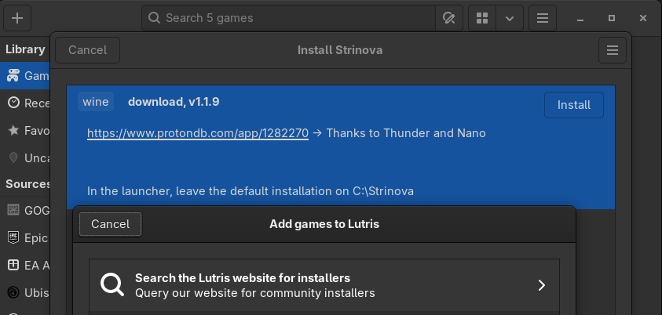

# Video guide
https://www.youtube.com/watch?v=ylbCdFw0ACU

# Text Guide

## 1. Installing launcher
> [!NOTE]
> Recommend to leave installation path `C:\Strinova`

### Install from Lutris (Recommend)
- Click the `+` icon 
- Find `Strinova` in `Searh the lutris site for installers`

### Manual import
- Download the yaml playbook [here](./strinova.yml).
- click the `+` icon in lutris
- Select `Install from a local install script`
- Select the downloaded yaml file

### After installing
After installing the launcher, close the window and run the launcher in Lutris

## 2. Game installation
> [!WARNING]
> Game installation(and update) and running game may require different wine versions!
> If installation failed (launcher crashes), select `wine-ge-proton-8.26` as your runner

> [!NOTE]
> Recommend to leave installation path `C:\Strinova\Game`

### Installing the game using launcher
- Well... Login and install the game

### Import existing installation from Windows
- Copy game to `Strinova/Game`
- Open `Strinova/config.ini`
- Change `CurrentGameVersion` to `1.3.10.21`
- Change `CurrentStage` to `INITSTAGE`

The version will fall out of date over time, copy new value from Windows or start downloading fresh to get current version string

## 3. Launching the game
Change wine runner to listed below
- `wine 10.7 staging` *tested*
- [`wine-tkg 10.4 staging ntsync`](https://github.com/future-XD/wine-tkg-staging-ntsync-git) *tested*
- [`wine-tkg 10.10 staging ntsync`](https://github.com/Kron4ek/Wine-Builds/releases/tag/10.10) *tested*

...or any `wine-tkg 10.X staging` *not tested by repository maintainers*

> [!TIP]
> Successfully launched the game? Take a moment and [report your hardware](https://github.com/aamaanaa/strinova-linux/issues/new/choose)